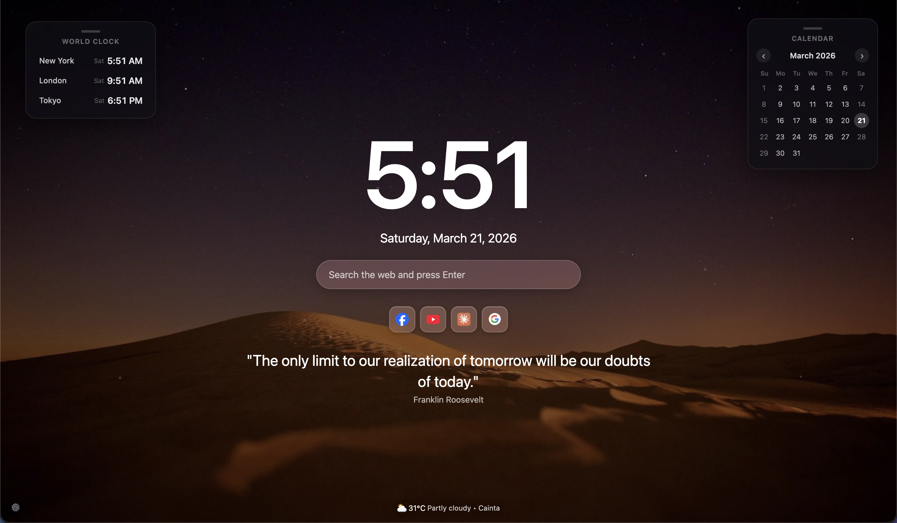

# 🌿 Zen New Tab

**Zen New Tab** transforms your browser’s start page into a unified, distraction-free sanctuary.  
Designed to reduce digital clutter, Zen New Tab harmonizes essential tools into a single, calming dashboard.

A minimalist Chrome extension focused on **clarity, calm, and productivity**.

---

## ✨ Features

- 🕒 **Time & Date**  
  View the current time and date at a glance.

- 💬 **Daily Quotes**  
  Start each day with inspiring and mindful quotes.

- 🌄 **Beautiful Backgrounds**  
  Rotating high-quality backgrounds for a calming visual experience.

- 🌦 **Weather Updates**  
  See your local weather instantly without opening another tab.

- 🔍 **Quick Search**  
  Search your favorite websites directly from the new tab.

---

## 📸 Preview

---

## 🚀 Install

Install Zen New Tab directly from the Chrome Web Store:

👉 **[Install Zen New Tab](https://chromewebstore.google.com/detail/chhlgdhacpabpphphdhjicnpbpklpdbk)**

---

## 🧘 Why Zen New Tab?

Most new tabs are noisy or empty.  
Zen New Tab gives you:

- One unified dashboard  
- No distractions  
- A calming aesthetic  
- Fast access to what matters  

Perfect for focused work and mindful browsing.

---

## 🛠 Tech Stack

- HTML5
- Tailwind CSS
- Vanilla JavaScript
- Chrome Extension APIs

---

## 🔒 Privacy

Zen New Tab respects your privacy.

- No tracking
- No ads
- No data collection

📄 **[Privacy Policy](https://zen.geanpaulo.com/privacy.html)**

---

## 📖 Changelog

View release updates and improvements here:

📄 **[Changelog](https://zen.geanpaulo.com/devinfo.html)**

---

## 👨‍💻 Developer

Built with care by **Gean Paulo**  
🌐 https://geanpaulo.com

If you have feedback or suggestions, feel free to open an issue or reach out!

---

## ⭐ Support the Project

If you enjoy Zen New Tab:

- Leave a ⭐ on GitHub
- Share it with others
- Leave a review on the Chrome Web Store

Your support helps keep the project growing 🌱
