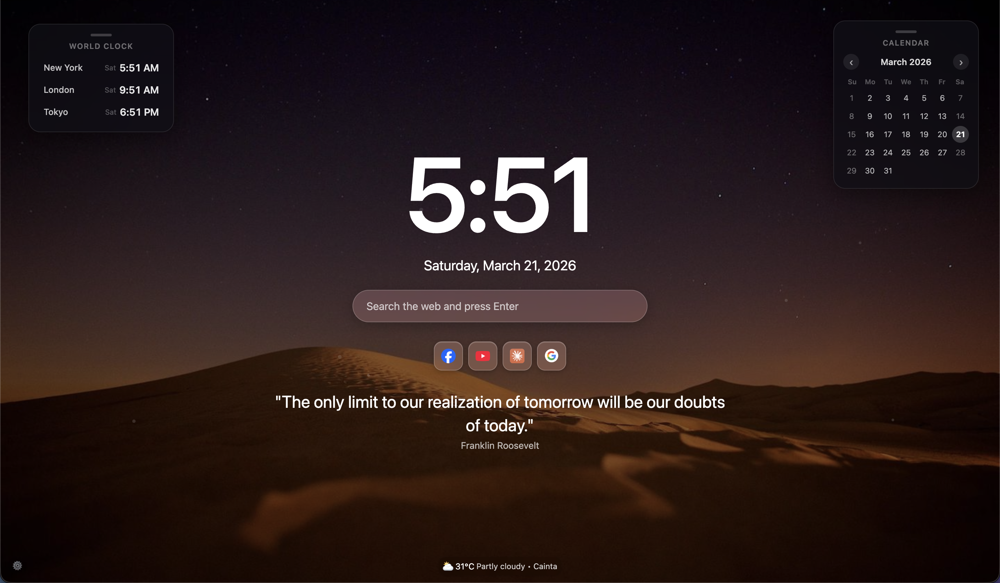

# 🌿 Zen New Tab

**Zen New Tab** transforms your browser's start page into a unified, distraction-free sanctuary.
Designed to reduce digital clutter, it brings together essential tools into a single, calming dashboard.
A minimalist Chrome extension focused on **clarity, calm, and productivity**.

---

## ✨ Features

### Core Dashboard
- 🕒 **Time & Date** — Animated digit transitions with 12/24-hour format support
- 💬 **Daily Quotes** — Rotating inspiration from multiple curated sources
- 🌄 **Beautiful Backgrounds** — Daily high-quality photos from Unsplash and Lorem Picsum, or upload your own custom wallpaper
- 🌦 **Live Weather** — Real-time local weather via Open-Meteo, auto-detected from your location
- 🔍 **Smart Search** — Search with real-time suggestions and ghost-text autocomplete
- 🔗 **Quick Links** — Pin your most-visited sites for one-click access, fully manageable from Settings
- ✨ **Particles** — Optional subtle floating particle overlay

### Productivity Mini-Apps
All widgets are draggable, persistent, and toggled from the Settings modal.

- 🍅 **Pomodoro Timer** — Focus, Short Break, and Long Break modes with animated SVG ring and wall-clock accuracy
- ⏱ **Countdown Timer** — Quick presets (5m to 1h), custom input, tab-title countdown, and audio alarm
- 🌍 **World Clock** — Up to 8 cities with live times; add any city by name with automatic timezone lookup
- ✅ **To-do List** — Persistent checklist with done/undone toggle and one-click clear of completed items
- 📅 **Calendar** — Monthly view with today highlighted, weekend dimming, and month navigation
- 🎵 **Focus Sounds** — Offline ambient noise (Rain, Wind, Ocean, Fire, White Noise, Brown Noise) generated via Web Audio API
- 📝 **Sticky Notes** — Draggable frosted glass notes with jewel-toned colors, resizable and saved between sessions

---

## 📸 Preview

---

## 🚀 Install

Install Zen New Tab directly from the Chrome Web Store:

👉 **[Install Zen New Tab](https://chromewebstore.google.com/detail/chhlgdhacpabpphphdhjicnpbpklpdbk)**

---

## 🧘 Why Zen New Tab?

Most new tabs are noisy or empty.
Zen New Tab gives you a single, focused dashboard that respects your attention:

- One place for everything you actually need
- No distractions, no noise
- Calming ambient aesthetic
- Every feature is optional and toggleable
- Works fully offline for core functionality

---

## 🛠 Tech Stack

- **HTML5 / CSS3 / Vanilla JavaScript** — zero frameworks, zero dependencies
- **Chrome Extension Manifest V3**
- **Web Audio API** — for offline-generated focus sounds
- **Open-Meteo API** — weather and timezone lookups
- **Nominatim / OpenStreetMap** — city geocoding for World Clock and weather
- **Unsplash + Lorem Picsum** — daily background imagery via proxy

---

## 🔒 Privacy

Zen New Tab is private by default.

- No tracking, no ads, no data collection
- All user data (notes, tasks, preferences, wallpaper) stays in your browser's `localStorage`
- No personal information is ever sent to a server
- Fully compliant with the Google Web Store Limited Use Policy

📄 **[Privacy Policy](https://zen.geanpaulo.com/privacy.html)**

---

## 📖 Changelog

View the full history of updates and improvements:

📄 **[Changelog](https://zen.geanpaulo.com/devinfo.html)**

| Version | Date | Highlights |
|---------|------|------------|
| v2.0.0 | Mar 21, 2026 | 7 new mini-apps, Settings modal, Custom Wallpaper, Particles, shared drag system |
| v1.3.0 | Mar 01, 2026 | Vibrant Sticky Notes with glassmorphism |
| v1.2 | Jan 16, 2026 | Weather widget, Smart Search with suggestions |
| v1.1 | Jan 05, 2026 | Animated clock, responsive entrance animations |
| v1.0 | Jan 02, 2026 | Initial release |

---

## 👨‍💻 Developer

Built with care by **Gean Paulo**
🌐 [geanpaulo.com](https://geanpaulo.com)

Have feedback, a bug report, or a feature idea? Open an issue or reach out directly at [hello@geanpaulo.com](mailto:hello@geanpaulo.com).

---

## ⭐ Support the Project

If Zen New Tab brings a little calm to your day:

- Leave a ⭐ on GitHub
- Share it with a friend or colleague
- Leave a review on the Chrome Web Store
- [Donate via PayPal](https://www.paypal.me/GeanPaulo) to keep it ad-free and growing

Your support helps keep the project alive 🌱
